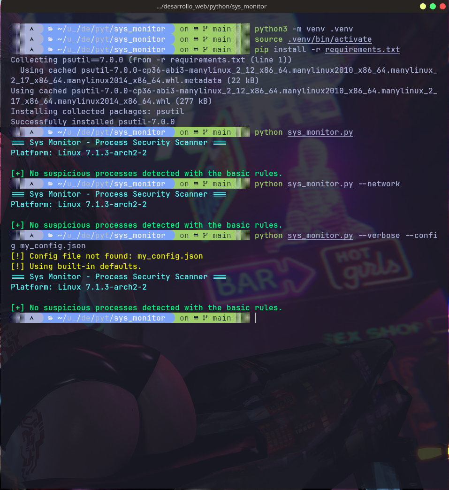
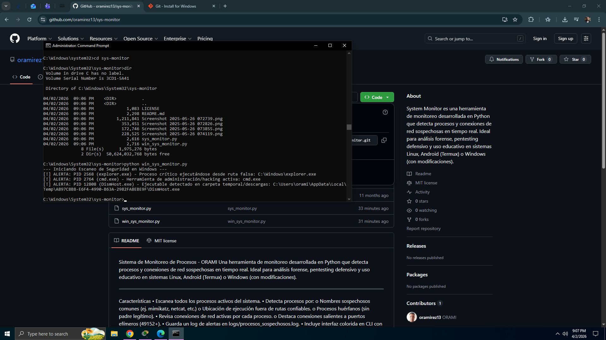

# Sys Monitor

Cross-platform process security scanner for Linux and Windows. Scans active processes and flags suspicious activity based on process names, executable paths, orphan processes, and network connections.

## Screenshots






## Features

- Cross-platform: works on Linux and Windows with platform-specific rules
- Detects known hacking tools by process name (mimikatz, nmap, hydra, etc.)
- Flags executables running from uncommon or untrusted paths
- Identifies orphan processes outside standard system directories
- Windows: detects process masquerading (fake lsass, svchost, etc.)
- Windows: flags executables running from Temp or Downloads folders
- Optional network connection monitoring on suspicious ports
- Configurable detection rules via `config.json`
- Save scan reports to file with timestamp
- Command-line arguments for flexible execution

## Requirements

- Python 3.11 or higher

## Installation

```bash
python3 -m venv .venv
source .venv/bin/activate
pip install -r requirements.txt
```

## Usage

```bash
# Basic scan
python sys_monitor.py

# Save report to file
python sys_monitor.py --output report.txt

# Include network connection checks
python sys_monitor.py --network

# Verbose mode with custom config
python sys_monitor.py --verbose --config my_config.json
```

## Command-line Options

| Option | Description |
|--------|-------------|
| `-o`, `--output` | Save report to a text file |
| `-n`, `--network` | Check for suspicious network connections |
| `-v`, `--verbose` | Show detailed scan information |
| `-c`, `--config` | Path to custom `config.json` file |

## Configuration

Edit `config.json` to customize detection rules:

- `trusted_paths_linux` / `trusted_paths_windows`: Directories considered safe
- `suspicious_names_linux` / `suspicious_names_windows`: Process names to flag
- `critical_windows_processes`: Windows system processes to protect
- `suspicious_ports`: Network ports that trigger alerts

## Project Structure

```
sys_monitor/
├── sys_monitor.py      # Main scanner script (Linux + Windows)
├── config.json         # Detection rules configuration
├── requirements.txt    # Python dependencies
├── img/                # Screenshots
├── README.md           # Documentation
└── .gitignore
```

## Detection Rules

### Linux
- Process name matches a known hacking tool
- Executable path is outside trusted directories and user home
- Orphan process (parent PID 1) not in system directories

### Windows
- Process name matches known hacking tools (mimikatz, psexec, etc.)
- Critical system process (lsass, svchost) running from wrong path
- Executable running from Temp or Downloads folder

## Notes

These alerts are basic heuristics and should be interpreted as support, not as automatic threat confirmation. Always perform manual analysis on flagged processes.
